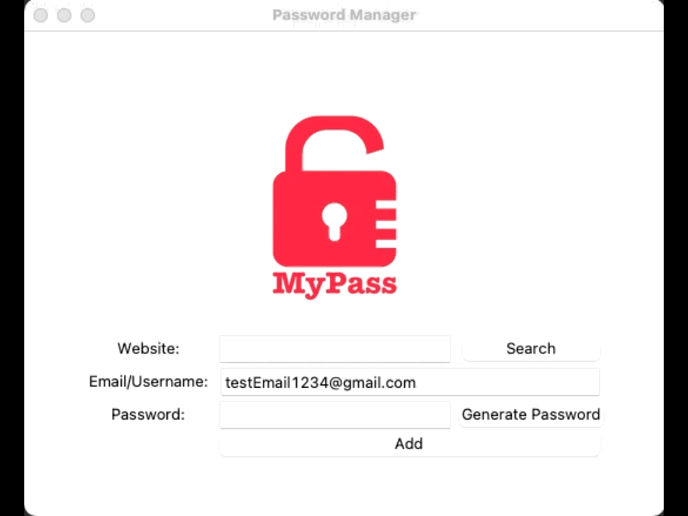
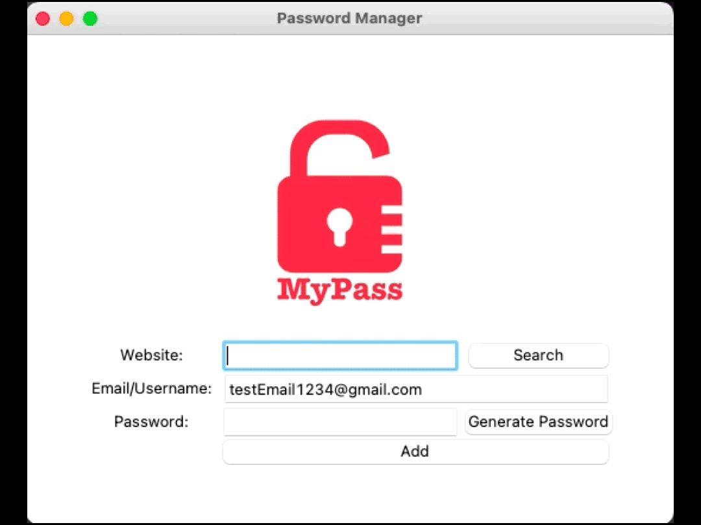

# Password Manager App

This is a GUI application that allows you to:
* Store already existing passwords
* Generate passwords for a new account
* Search existing passwords that have already been entered into the app and return them to the user

## Demo

To create a new entry for a password follow these steps:
1. Enter the website name
2. Edit the username or email into its field
3. Type the password that corresponds with the website. If you would like a strong randomized password, click "Generate password"

To search for an already entered password:
1. Enter the website name
2. Click the "Search" button

